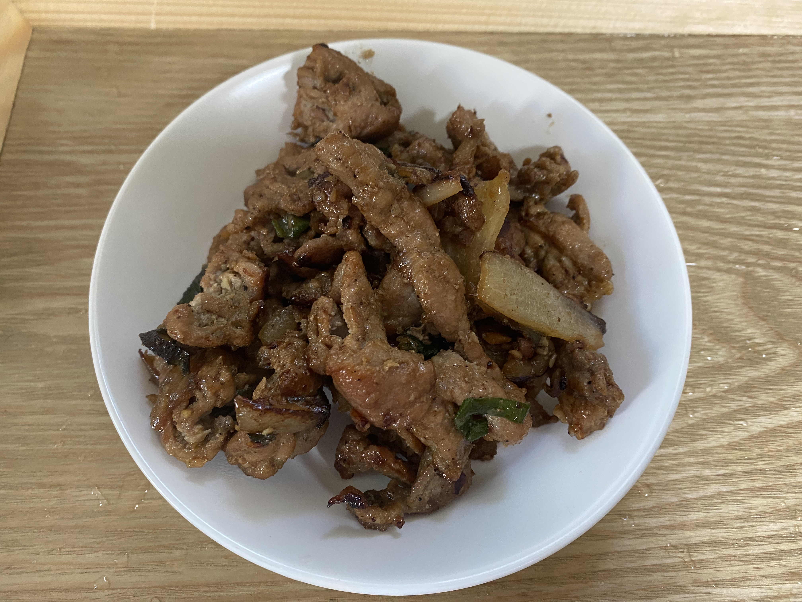

간장불고기
=============
참고 레시피
-------------
##### 하루 한 끼: https://www.youtube.com/watch?v=YV16QRDdQXE

요리 후기
----------
#### 요리시간 50분(고기 재우는 시간이 그중 30분). 난이도 ★
맛있고 매우 간단

재료
-------------
1. 돼지고기 (앞다리 불고기감 600g)
2. 양파 반쪽
3. 대파

양념재료:
- 간장6 , 설탕2, 다진마늘1, 참기름1, 후추 약간 (+맛술도 있으면 2스푼)

만드는 법
-------------
1. 양념을 고기에 섞은후 냉장고에 30분 재어둔다.
2. 팬에 기름을 두르고 달군다. 그 후에 고기를 넣는다 (중불)
3. 고기 겉면이 익으면 양파를 넣고 노릇해지게 볶는다(센불)
4. 마지막으로 대파를 넣고 1~2분후 불을 끈다
