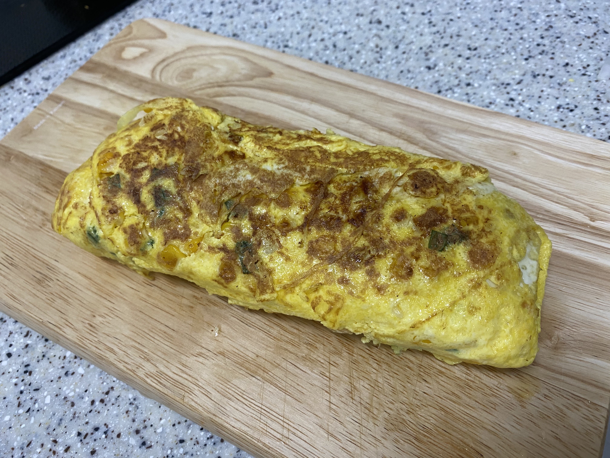
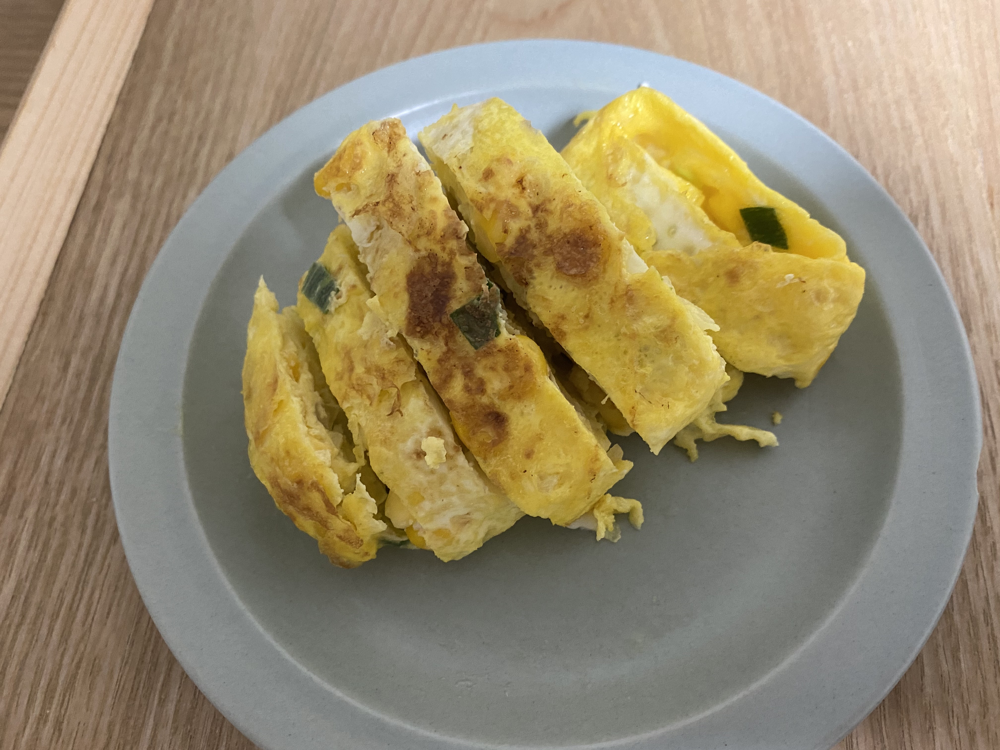

계란말이
=============
참고 레시피
-------------
##### 하루 한 끼: https://www.youtube.com/watch?v=3zByKGTIhZ0

요리 후기
----------
#### 요리시간 30분. 난이도 ★★
요리 자체는 쉽다. 

하지만 계란 말기가 쉽지 않다.

남은 양파나 파 처리하기에 좋다.

재료
-------------
> ① 계란4~6개 + 소금
>
> ② 스위트콘, 당근, 대파 등 자투리 채소

만드는 법
-------------
1.계란은 잘 풀어두고 다진 채소, 스위트콘 등을 넣는다 (+소금 조금)

2.팬에 기름을 두르고 키친타올로 살짝 닦아준다

3.계란물을 넣고 밑면이 익으면 조금씩 말아주기 시작한다 (처음부터 끝까지 약불)

4.다 말아진 계란말이는 한김 식히면 예쁘게 썰 수 있다

5.맛있게 먹는다