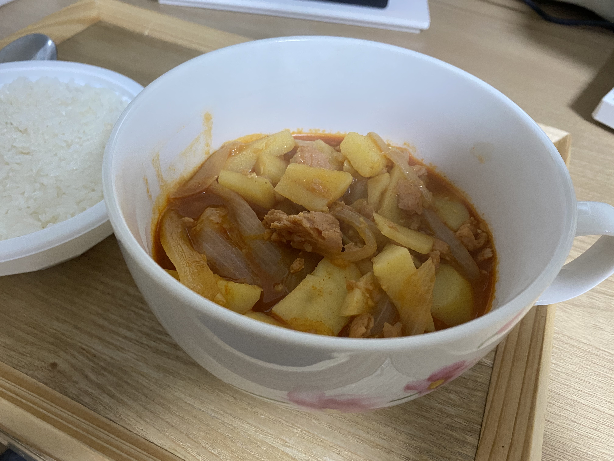

감자짜글이
=============
참고 레시피
-------------
##### 백종원의 요리비책: https://www.youtube.com/watch?v=wpUsg7f-F4o

요리 후기
----------
#### 요리시간 30분. 난이도 ★
자취생 핵가성비 음식.
 
감자, 양파, 스팸에다가, 기본 양념들(고추장, 간장, 설탕, 마늘)만 있으면 된다.

고춧가루 같은건 솔직히 없어도 괜찮음.

라면 끓이는 것보다 살짝 어려운 수준의 음식인데 밥도둑이다(feat. 양세형).

이거 하나면 다른거 필요 없고 밥에다 비벼먹으면 된다.

그래서 자주 해먹는 음식. 남은 감자랑 양파 처리하기도 좋다.

재료
-------------
>감자 2개(400g)
>
>양파 1/2개(100g)
>
>대파 1컵(80g)
>
>청양고추 3개(15g)
>
>통조림햄 1캔(200g)
>
>간마늘 1큰술(15g)
>
>된장 1/2큰술(10g)
>
>고추장 1큰술(20g)
>
>굵은고춧가루 2큰술(10g)
>
>황설탕 1큰술(10g)
>
>진간장 4큰술(40g)
>
>물 4컵(700g)

만드는 법
-------------
1. 감자, 양파는 1cm 정도 두께로 굵게 채 썰어 준비한다.
2. 청양고추는 1cm 정도로 썰고 대파는 송송 썰어 준비한다.
3. 통조림 햄은 밀폐 봉지에 넣어 잘게 으깨어 준다.
4. 냄비에 감자를 깔고 양파, 대파, 청양고추, 통조림햄을 넣는다.
5. 황설탕, 고춧가루, 간마늘, 고추장, 된장, 진간장, 물을 넣어 끓인다.
6. 끓어오르면 약불로 줄이고 양념장이 골고루 섞일 수 있도록 저어준다.
7. 국물이 반 정도 졸아들면 기호에 맞게 간장을 추가하여 간을 맞춘다.
8. 감자가 으깨질 정도까지 끓여 완성한다.