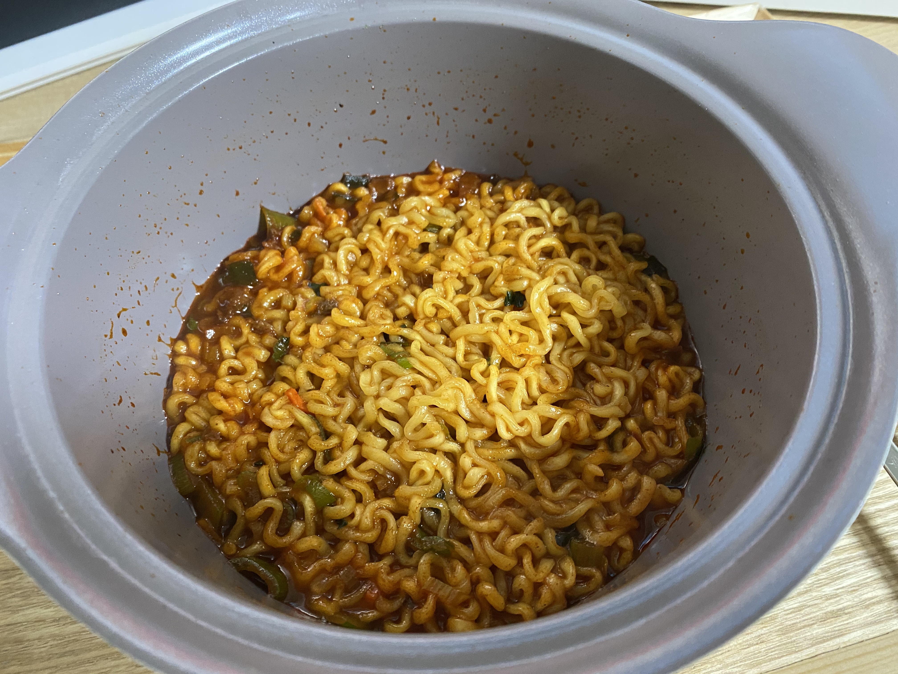

라볶이
=============
참고 레시피
-------------
##### 백종원의 요리비책: https://www.youtube.com/watch?v=6e-IbuuD6ZU

요리 후기
----------
#### 요리시간 10분. 난이도 ★

가끔 그냥 라면 끓여먹기 싫증나고 자극적인거 땡길 때 하기 좋겠다.

재료
-------------

- 순한맛라면 1개
- 대파 약 1/3대(30g)
- 정수물 1과 1/2컵(270g)
- 황설탕 1큰술(12g)
- 고추장 1큰술(20g)

만드는 법
-------------
1. 대파는 송송 썰어 준비한다.
2. 냄비에 물, 분말스프(1/2~2/3), 건더기스프, 설탕, 고추장을 넣고 풀어주며 끓인다.
   (분말스프의 양은 기호에 맞게 조절한다.)
3. 육수가 끓으면 면을 넣고 끓인다.
4. 면이 완전히 풀어지면 대파를 넣고 1분정도 더 끓인다.
5. 물이 졸아들고 면이 익으면 불을 끄고 그릇에 담아 완성한다.
