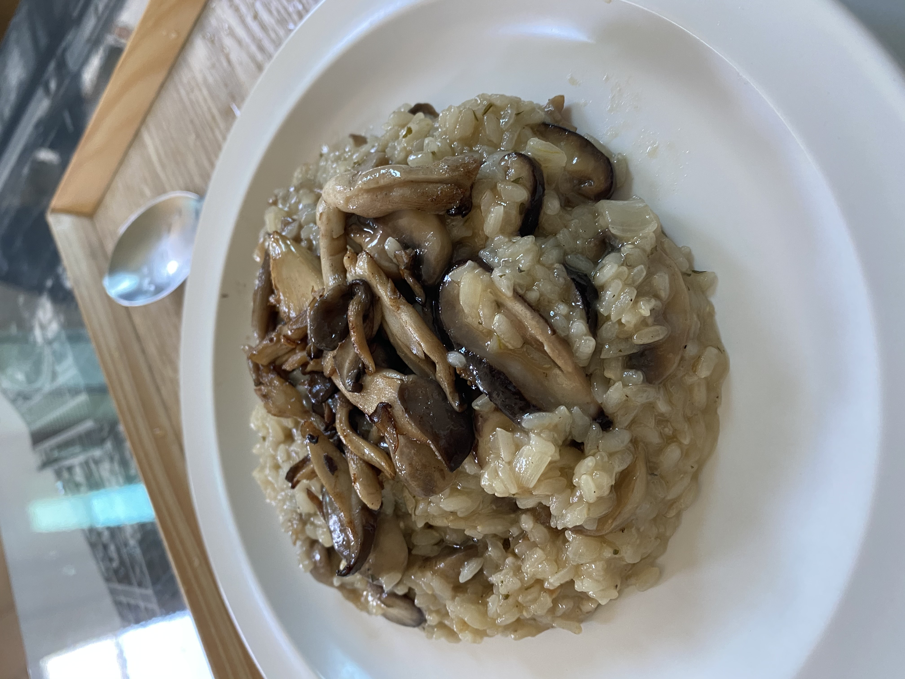

버섯리조또
=============
참고 레시피
-------------
##### 고기남자: https://www.youtube.com/watch?v=C2OWoxLYNf0

요리 후기
----------
#### 요리시간 30분. 난이도 ★★★☆
후라이팬 2개 있어야 해먹기 좋음.

버섯 좋아하면 진짜 환장할 요리. 내가 한 요리지만 너무 맛있었다.

아래 재료는 2인 기준

재료
-------------
> 양파 반개
>
> 양송이 버섯 200g정도
>
>느타리,표고버섯 (선택)
>
>다진마늘 1큰술
>
>올리브오일
>
>이탈리안 파슬리 (쪽파가능)
>
>쌀 200~250g정도
>
>치킨스톡(가루, 큐브, 액상도 상관 없음)
>
>화이트와인 (선택)
>
>파르산 치즈 (선택)
>
>트러플오일 (선택)

만드는 법
-------------
1. 물 700mL에 치킨스톡 넣고 끓이기
2. 후라이팬에 올리브유 넉넉히 두르고 다진마늘로 기름 내기
3. 썰어놓은 양송이 150g과 표고버섯 2개를 넣는다
4. 약한불로 볶으면서 소금 넣어 버섯 땀 빼주기.
5. 다 익히면 후라이팬에서 버섯 덜어내고 보관.
6. 후라이팬에 올리브유 두르고 썰어둔 양파와 표고버섯 밑동 넣어 볶기
7. 양파가 투명해지면 안씻은 쌀 넣기
8. (생략 가능) 화이트와인 100ml 넣고 와인향이 다 날아갈 때까지 볶는다.
9. 4회 이상에 걸쳐 치킨스톡을 넣고 계속 볶아준다. 나무주걱으로 밥알 눌러주면서 하면 좋음.
10. 땀빼주었던 버섯 넣고 트러플오일 넣고, 파슬리 넣고 섞어준다.
11. 다른 후라이팬에 버터를 둘러주고 느타리버섯, 양송이 버섯 50g 썰어 볶아준다.
12. 소금도 같이 넣어서 땀빼주기.
13. 밥 플레이팅하고 버터버섯 위에 토핑.
14. 쪽파를 밥 위에 뿌려주고, 파르메산 치즈 갈아 넣준다.