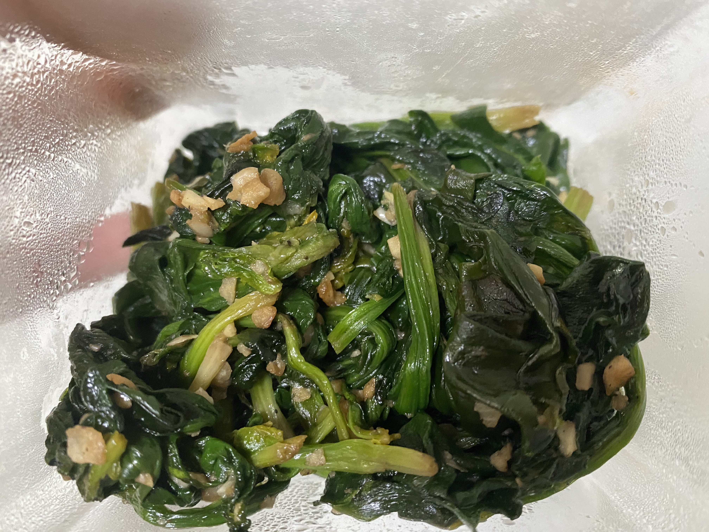

버섯리조또
=============
참고 레시피
-------------
##### 만개의 레시: https://www.10000recipe.com/recipe/6894626

요리 후기
----------
#### 요리시간 10분. 난이도 ★
쉽고 맛있음. 시금치는 살짝 데치는 게 더 맛있을 거 같다. 키토제닉 하게 되면 자주 먹을듯.

재료
-------------
> 필수재료: 시금치 200g, 버터, 물(1/2 종이컵), 다진마늘, 소금, 후추
>
> 선택재료: 파마산치즈

만드는 법
-------------
1. 시금치는 밑단을 잘라 준비한다.
2. 냄비에 물 1/2 종이컵을 넣고 뚜껑을 덮어 중불에 찌듯이 익힌다.
3. 팬에 버터를 녹이고 다진마늘, 익힌 시금치를 넣고 볶는다.
4. 소금, 후추를 넣는다.
5. 파마산 치즈를 갈아 넣어 잘 섞어 완성한다.