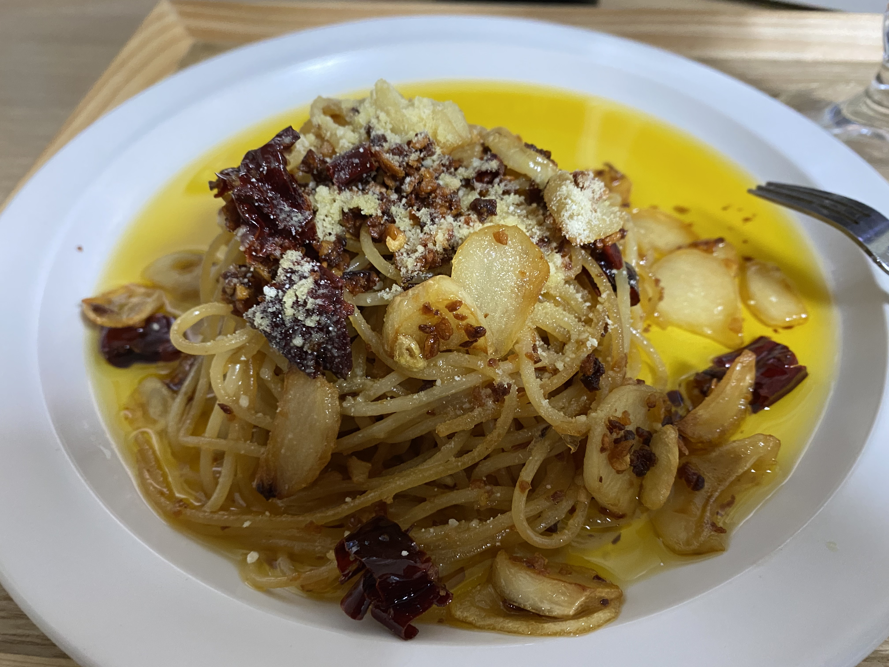

알리오올리오
=============
참고 레시피
-------------
##### : https://www.youtube.com/watch?v=ohihzV6Z85k

요리 후기
----------
#### 요리시간 20분. 난이도 ★★
면 후라이팬에 조금만 익힐 것. 쉬운 요린데 오래 놔두면 튀겨짐(이번에 튀겼음);;

재료
-------------
* 면 삶기
> 정수물 약6컵(1L)
>
> 파스타면 100g
>
> 꽃소금 1/3큰술(4g)

* 알리오올리오
>
>면수 약1/3컵(70ml)
>
>올리브유 약1/3컵(55g)
>
>간 마늘 2큰술(40g)
>
>통마늘 약 4개(21g)
>
>쪽파 약간(4g)
>
>페퍼론치노 5개(2g)
>
>삶은 파스타면 전량
>
>꽃소금 약간
>
>파마산치즈가루 약간>

만드는 법
-------------
* 면 삶기
1. 냄비에 정수물, 꽃소금을 넣고 강 불에 올려 끓인다.
2. 물이 끓어 오르면 스파게티면을 펼쳐 넣고 젓가락을 이용하여 면을 냄비 안으로 넣어 약 7~8분정도 삶는다.
   Tip. 스파게티면은 기호에 맞는 익힘 정도로 삶는다.
3. 삶아 진 스파게티면은 체에 밭쳐 건져내어 준비한다.

* 알리오올리오
1. 통마늘은 0.2cm 두께로 편 썰고, 쪽파는 0.3cm 두께로 송송 썰어 준비한다.
2. 프라이팬에 올리브유를 두르고 편 마늘을 넣은 후 중 약불에 올려 볶는다.
3. 기름이 지글지글 거리기 시작하면 페퍼론치노를 1/2정도 크기로 부숴 넣는다. 
4. 편 마늘이 노릇노릇해지기 시작하면 간 마늘을 넣고 함께 볶는다. 
5. 간 마늘이 노릇하게 색이나면 건져 둔 면을 체에 밭친 상태로 면수에 가볍게 헹군 후 물기를 가볍게 털어내고 팬에 넣는다.
6. 젓가락을 이용하여 볶아 둔 마늘과 면을 가볍게 볶은 후 면수를 넣고 강 불로 키워 볶는다.
  Tip. 기호에 따라 소고기다시다 또는 치킨파우더를 넣는다.
7. 면수와 올리브오일이 골고루 섞이고 면에 간이 배이면 불을 끈다.
8. 접시에 스파게티를 옮겨 담은 후 쪽파를 올린다.
9. 파마산치즈가루를 뿌려 완성한다.
  Tip. 그라나파다노치즈를 올려 먹으면 더욱 좋다.
